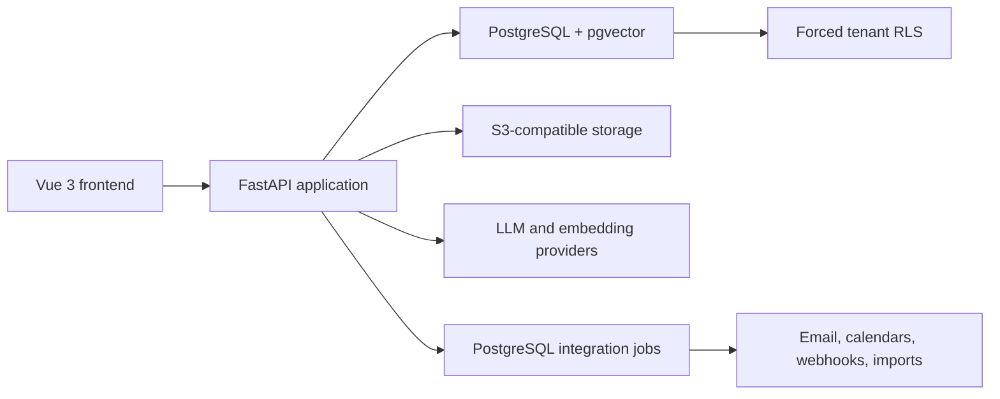

# CRM Sales

Production-oriented B2B CRM reference platform for sales teams.

CRM Sales is a portfolio-grade application that demonstrates how a secure,
AI-assisted CRM can be designed for real company workflows. It is built as a
reusable foundation for custom CRM development, not as a claim of feature parity
with Salesforce or another established commercial platform.

> **Project status:** functional pre-production platform. The core sales workflow,
> tenant isolation, company workspace, knowledge retrieval, AI assistance,
> analytics, role-based access control, and selected integrations are implemented.
> Operational hardening, automation, and deployment remain in progress.

## Product direction

The current demo targets B2B sales departments and uses the company as the main
business object:

```text
Company → Contacts → Leads → Deals → Communications
        → Sequences → Tasks → Timeline
        → Documents → Knowledge → AI context
```

The architecture is intended to be adapted to each customer's processes,
permissions, integrations, terminology, and industry requirements.

## What the project demonstrates

- company-first sales workspace with customer context in one place;
- contacts, leads, pipelines, deals, tasks, notes, and next actions;
- complete CRM record lifecycle with qualification, conversion, merge, archive,
  soft delete, restore, bulk actions, reassignment, and optimistic locking;
- unified activity timeline and communication inbox;
- contact sequences/cadences with scheduled task, call, manual-email, and
  connector-backed automatic-email steps;
- tenant-safe PostgreSQL data model with database-enforced isolation;
- short-lived access tokens, rotating refresh sessions, password recovery,
  login rate limits, TOTP MFA, and one-time recovery codes;
- document upload, OCR, S3-compatible storage, and scoped RAG;
- AI copilot with grounded context and confirmation before CRM mutations;
- pipeline analytics, forecasting, deal risk, and manager-level signals;
- configurable trigger-condition-action automation, approvals, scheduled checks,
  message templates, and transactional delivery outbox;
- bidirectional IMAP/SMTP email, Google and Microsoft calendar OAuth,
  signed webhooks, scoped public API keys, and mapped CSV/XLSX import;
- industry templates, feature flags, tenant plans, audit data, and export;
- Vue-based responsive workspace backed by a modular FastAPI API.

## Current workspace

- **Home** — daily priorities, pipeline summary, and AI recommendations;
- **Companies** — company list and unified customer workspace;
- **Leads** — demand pipeline;
- **Deals** — pipeline and opportunity management;
- **Tasks** — execution and deadlines;
- **Inbox** — communication hub;
- **Knowledge** — workspace documents and RAG;
- **Analytics** — revenue intelligence and forecast;
- **Settings** — connectors, templates, and administration.

## Architecture



The backend is a modular monolith. Business modules include accounts, sales,
activities, communication, sequences, knowledge, AI agent, analytics, connectors,
templates, and production administration.

## Tenant isolation

Tenant isolation is enforced in two independent layers:

1. API dependencies verify the authenticated user's tenant membership.
2. PostgreSQL applies `ENABLE ROW LEVEL SECURITY` and
   `FORCE ROW LEVEL SECURITY` to tenant-owned business tables.

Request transactions switch to a restricted runtime role and set the verified
tenant context. Without that context, tenant-owned rows are unavailable.
Tenant-aware composite foreign keys also reject cross-tenant object references.

This protects the system from a forgotten application-level `tenant_id` filter.

## Role-based access control

Every membership has one of five fail-closed roles: `owner`, `admin`,
`sales_manager`, `sales_rep`, or `viewer`. A centralized permission matrix
protects tenant administration, billing, feature flags, integrations, exports,
knowledge writes, AI actions, and CRM mutations. Sales representatives can
change only their assigned objects and cannot write manager-controlled fields.
The `/me` response exposes effective permissions for frontend capability checks.

## Team management and routing

Tenant administrators can invite users with expiring one-time tokens, change
roles, deactivate or reactivate memberships, and safely reassign owned CRM
records. Sales structure supports teams and cycle-safe manager hierarchies.
Managers can configure lead queues, round-robin routing, assignment rules, and
account territories. All routing targets use tenant-aware constraints, and the
new tenant tables are protected by forced RLS.

## CRM and AI safety model

- knowledge retrieval is filtered by tenant and explicit global, company, or
  deal scope before similarity ranking;
- embeddings are stored as native PostgreSQL `vector(1536)` values;
- uploaded files have size, page, and extraction limits;
- AI responses can include retrieved CRM and knowledge context;
- write operations proposed by the AI remain pending until confirmed by a user;
- remote embedding configuration fails explicitly instead of silently falling
  back to development embeddings.

## Technology stack

| Layer | Technology |
|---|---|
| Backend | Python 3.12, FastAPI, SQLAlchemy, Alembic |
| Database | PostgreSQL, pgvector |
| Frontend | Vue 3, TypeScript, Vue Router, Vite |
| Authentication | Short-lived JWT, rotating refresh sessions, TOTP MFA |
| Files | S3-compatible storage, MinIO for local development |
| Documents | PDF, DOCX, TXT, OCR through Tesseract |
| AI | OpenAI-compatible LLM and embedding providers |
| Runtime | Docker Compose |

## Local development

### Requirements

- Python 3.12;
- Node.js 20.19+ or 22.12+ and npm;
- Docker with Docker Compose.

### Install dependencies

```bash
python -m venv .venv
source .venv/bin/activate
pip install -r requirements-dev.txt
npm --prefix frontend install
cp .env.example .env
```

Review `.env` before starting the application. Local defaults are not suitable
for an internet-facing deployment.

### Start the workspace

```bash
make dev
```

This starts PostgreSQL and MinIO, applies Alembic migrations, and runs the
backend, frontend, and integration background worker.

Open:

- frontend: `http://localhost:5173`;
- API documentation: `http://localhost:8000/docs`;
- MinIO console: `http://localhost:9001`.

### Local developer workspace

```bash
python scripts/dev_access.py
```

The script creates or refreshes the local `owner@example.com` test account and
the `developer-test` tenant. Set `DEV_USER_PASSWORD` in the local `.env` first.
These credentials are for local development only.

### Demo dataset

```bash
python scripts/seed_demo.py
```

The seed is repeatable and recreates only the dedicated demo tenant.

## Verification

```bash
make test
```

The quality gate runs Ruff, backend unit tests, isolated PostgreSQL integration
tests, frontend type checking and unit tests, a production build, and
`alembic check`. By default it creates and removes only the dedicated
`cmr_quality_gate_test` database. A CI environment may provide its own disposable
`TEST_DATABASE_URL` instead.

Run scheduled automation once from cron or a worker scheduler:

```bash
make automation-run
```

Process one integration-job batch manually:

```bash
make integrations-run
```

## Configuration highlights

```text
DATABASE_URL
DATABASE_RUNTIME_ROLE
SECRET_KEY
APP_ENVIRONMENT
REFRESH_TOKEN_EXPIRE_DAYS
AUTH_COOKIE_SECURE
AUTH_EXPOSE_RESET_TOKEN
AUTH_SMTP_HOST
AUTH_SMTP_FROM_EMAIL
LLM_API_KEY
LLM_BASE_URL
LLM_MODEL
EMBEDDING_PROVIDER
EMBEDDING_API_KEY
EMBEDDING_BASE_URL
EMBEDDING_MODEL
EMBEDDING_DIMENSIONS
KNOWLEDGE_STORAGE_BACKEND
S3_ENDPOINT_URL
S3_ACCESS_KEY
S3_SECRET_KEY
S3_BUCKET
PUBLIC_API_BASE_URL
FRONTEND_URL
GOOGLE_OAUTH_CLIENT_ID
GOOGLE_OAUTH_CLIENT_SECRET
MICROSOFT_OAUTH_CLIENT_ID
MICROSOFT_OAUTH_CLIENT_SECRET
MICROSOFT_OAUTH_TENANT
```

The complete development template is available in `.env.example`.

## Implemented

- modular CRM backend and Vue workspace;
- PostgreSQL migrations through `0024_pilot_authentication`;
- native pgvector storage and scoped retrieval;
- company workspace and activity timeline;
- analytics and AI-assisted recommendations;
- bidirectional IMAP/SMTP email with encrypted credentials;
- Google Calendar incremental sync and Microsoft Graph delta sync through OAuth 2.0;
- background integration jobs with retry, idempotency, stale-worker recovery,
  dead-letter queue, replay, and per-attempt error journal;
- HTTPS webhooks with HMAC-SHA256 signatures and SSRF restrictions;
- hashed, scoped public API keys and `/public/v1/leads`;
- CSV/XLSX import with preview, field mapping, validation, and background execution;
- MinIO/S3 file storage and OCR;
- forced tenant RLS and tenant-aware constraints;
- centralized RBAC with object- and field-level write protection;
- account security with HttpOnly refresh cookies, session revocation, password
  reset/change, rate limiting, TOTP MFA, and recovery codes;
- secure invitations, membership deactivation, teams, manager hierarchies,
  lead queues, assignment rules, and account territories;
- workflow automation with idempotent runs, approval decisions, scheduled
  inactive-deal processing, and auditable failures;
- searchable and paginated CRM CRUD with field-change history;
- tenant-safe sales sequences with contact enrollment, pause/resume/stop,
  reply-based exit, execution history, and CRM timeline integration;
- negative tenant-isolation and authorization tests;
- local and GitHub Actions quality gates.

## Hardening in progress

- production worker autoscaling and scheduler orchestration;
- structured audit events, monitoring, tracing, and alerting;
- AI/RAG evaluation and production guardrails.

## Planned product capabilities

- products, price books, quotes, and contract workflows;
- configurable reports, dashboards, quotas, and advanced forecasting;
- production deployment, backup, recovery, and compliance profiles.

## Integration boundaries

Google and Microsoft connections require customer-owned OAuth applications and
redirect URIs configured from `.env.example`. Email requires working IMAP and
SMTP credentials; the connection is tested before it is saved.

Telephony is intentionally not represented by a fake adapter: a provider such
as Mango, UIS, Zadarma, or a customer-specific PBX must be selected first.
Telegram/WhatsApp require a channel-ownership and consent decision for the
target market. A 1C integration requires the exact 1C configuration, exchange
transport, and master-data contract. The Settings page reports these boundaries
instead of offering non-functional connect buttons.

## Repository scope

This repository contains the executable reference implementation. Customer
deployments are expected to add environment-specific infrastructure,
integrations, access policies, workflows, and compliance controls.
